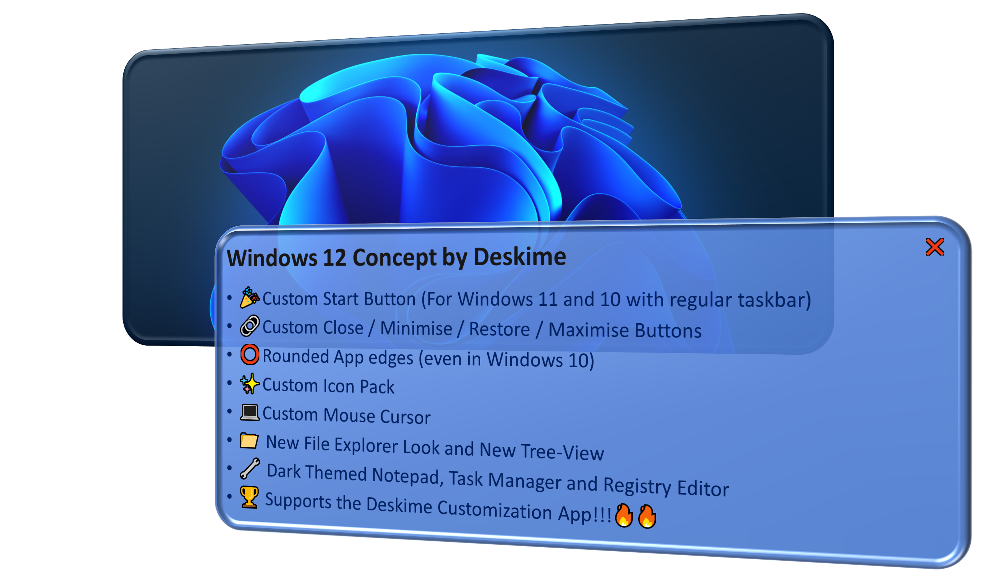
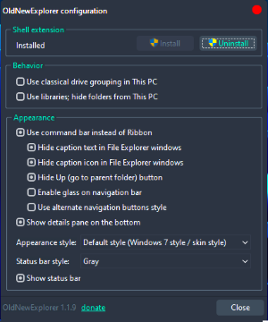

# Windows 12 Concept by Deskime

<div style="text-align: center;">


💪🏻 The Greatest, most Powerful version of Windows the world has ever seen
<br><br>
[](https://forthebadge.com)
[](https://forthebadge.com)

</div>

------------

## ✨ Features



---

## 📋 Setup

1. ⭐ Star and `clone` or download this repository
<br><br>
2. **Patch** your system using [SecureUXTheme](https://github.com/namazso/SecureUxTheme) or [UltraUXThemePatcher](https://mhoefs.eu/software_uxtheme.php?lang=en)
<br><br>
3. Apply the below configuration to [OldNewExplorer](https://msfn.org/board/topic/170375-oldnewexplorer-119/) if you are using it. (Recommended, but optional)<br><br>
<br><br>
4. Move all the contents in the folder respective to your OS Version (For Windows 10/ For Windows 11) to `C:\Windows\Resources\Themes`
<br><br>
5. Run `icon.reg` in Registry Editor to apply the icon pack.

### For Windows 10
- 1. **With Regular Taskbar**<br>
  Run the file `Windows 12-Regular.theme` and wait. After 15-20 seconds, you should see your computer looks change.<br>Finally, reboot your computer or restart `explorer.exe` from Task Manager to see the icons changed.
<br><br>
- 2. **With Center Taskbar**<br>
  - Pin `StartIcon-Win12.exe` as the first app in your taskbar
  - Right-click on your taskbar , and deselect `Lock the taskbar`
  - Again right-click on your taskbar, hover on `Toolbars` and click `New toolbar...`
  - Then navigate to `C:\Windows\Resources\Themes\Windows 12` and you should see a folder with a blank name ` `. Select that folder and add as the toolbar in your taskbar.
  - Now you should see a double bar `||` on the right half, towards the end of your taskbar. drag it to the left end until all the apps move to it's right. (the start button won't move to the right though.)
  -  After this, adjust the other side to match your taskbar centering.
  - Then, right-click on your taskbar and enable `Lock the taskbar`
  - After that, run the file `Windows 12-Center.theme` and wait. After 15-20 seconds, you should see your computer looks change.
  - Finally, reboot your computer or restart `explorer.exe` from Task Manager to see the icons changed.
<br><br>
### For Windows 11
Run the file `Windows 12.theme` and wait. After 15-20 seconds, you should see your computer looks change.
<br><br>
Finally, reboot your computer or restart `explorer.exe` from Task Manager to see the icons changed.

---

## 📃 References
- [Windows 12 Background - Addy Visuals](https://www.youtube.com/watch?v=1k1vz9PD7O4&ab_channel=AddyVisuals)
- [Windows 12 Start Icon - Icons8](https://icons8.com/icon/srWpsuip5wG0/windows-11)
- [Windows 12 Icon Pack - KDr3w](https://www.deviantart.com/kdr3w/art/Matte-758699852)
- [Windows 12 Cursors - JepriCreations](https://www.deviantart.com/jepricreations/art/Windows-11-Cursors-Concept-886489356)
- [Base Theme - Goon Theme by niivu]()
   <br><br>

> [!CAUTION]
> Remember to move all the required files and folders into the Themes folder, otherwise it won't work.

---

## 🛠️ Troubleshooting

- Ensure you have the latest version of the theme.
- Verify that all the files are put into the `Themes` folder.
<br><br>
   For further assistance, please create an issue on the [GitHub repository](https://github.com/Deskime/Windows_12/issues) with detailed information about your problem, including the error message and a screenshot.

---

## ✔ Additional tools

- [Deskime Customization](https://github.com/Deskime/Deskime_Customization) (Highly Recommended!)
- [ModernFlyouts](https://github.com/ModernFlyouts-Community/ModernFlyouts)
- [WindHawk](https://windhawk.net/)
- [StartAllBack]() or [Explorer Patcher]()
- [OldNewExplorer](https://msfn.org/board/topic/170375-oldnewexplorer-119/)
- [MicaForEveryone](https://github.com/MicaForEveryone/MicaForEveryone)
- [ExplorerBlurMica](https://github.com/Maplespe/ExplorerBlurMica)
- [Microsoft PowerToys](https://github.com/microsoft/PowerToys)
- [Writing Tools](https://github.com/theJayTea/WritingTools/)
- [Rainmeter](https://www.rainmeter.net/)
 
---

## 📄 License

This project is licensed under the GNU General Public License v3.0. See the [LICENSE](LICENSE) file for more details.

---

## ⚠️ DISCLAIMER

**THE SOFTWARE IS PROVIDED "AS IS", WITHOUT ANY WARRANTY OF ANY KIND, EXPRESS OR IMPLIED. THIS INCLUDES, BUT IS NOT LIMITED TO, WARRANTIES OF MERCHANTABILITY, FITNESS FOR A PARTICULAR PURPOSE, AND NON-INFRINGEMENT. IN NO EVENT SHALL THE AUTHORS OR COPYRIGHT HOLDERS BE LIABLE FOR ANY CLAIMS, DAMAGES, OR OTHER LIABILITIES, WHETHER IN AN ACTION OF CONTRACT, TORT, OR OTHERWISE, ARISING FROM, OUT OF, OR IN CONNECTION WITH THE SOFTWARE OR THE USE OR OTHER DEALINGS IN THE SOFTWARE.**

**IMPORTANT:** **THIS SOFTWARE IS A CONCEPTUAL THEME AND IS NOT AFFILIATED WITH, ENDORSED BY, OR IN ANY WAY CONNECTED TO MICROSOFT INC. OR ITS RELATED PROJECTS. USE AT YOUR OWN RISK, AND ENSURE YOU HAVE BACKUPS OF YOUR SYSTEM BEFORE APPLYING ANY MODIFICATIONS.**

**THIS PROJECT IS LICENSED UNDER THE GNU GENERAL PUBLIC LICENSE v3.0. YOU ARE FREE TO MODIFY AND DISTRIBUTE THIS SOFTWARE AS LONG AS YOU KEEP THE SAME LICENSE AND CREDIT THE CREATOR (HERE DESKIME).**

**BY USING THIS THEME, YOU ACKNOWLEDGE THAT YOU UNDERSTAND AND ACCEPT THESE TERMS. ENJOY CUSTOMIZING YOUR WINDOWS EXPERIENCE!**

---
### Special thanks to the concepts by [Addy Visuals](https://www.youtube.com/watch?v=1k1vz9PD7O4&ab_channel=AddyVisuals) and [niivu](https://www.deviantart.com/niivu/art/Windows-12-for-Windows-11-1139654666)

---

```javascript
try {
    if (u_scrolled_till_here) {
        star_repo();   //contribute to my github stats
        return "thanks in advance";
    }
} catch {
    if (u_liked_this_project) {
        share_repo(let_others_use);
    }
} finally {
    return "thanks for coming here \n do check my other projects";
}
```
<br><br>
[](https://ko-fi.com/deskime)